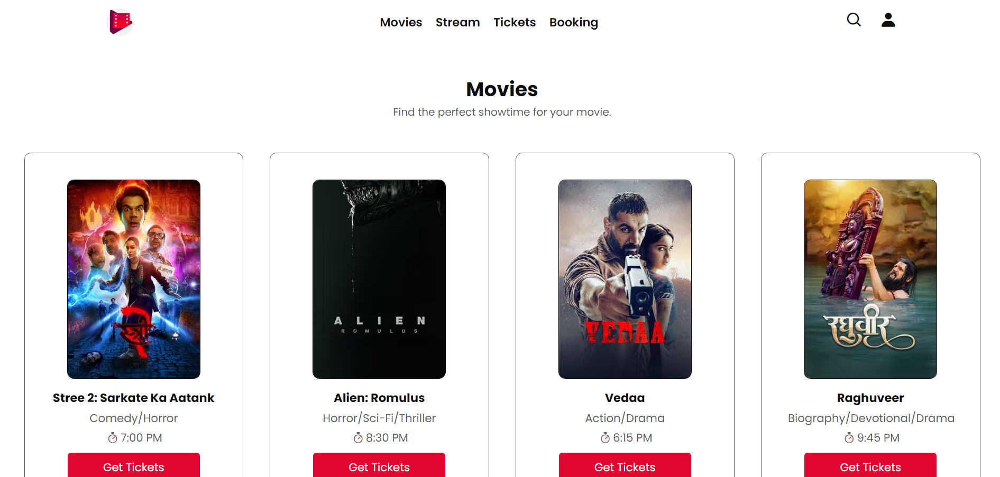

# Movie Ticket Booking Webpage

This is a simple, responsive movie ticket booking webpage designed using HTML and CSS. The webpage allows users to browse movies, stream new releases, purchase tickets, and book their tickets online. The design is optimized for mobile and tablet devices.

## Screenshot



## Technologies Used

- **HTML**: The structure and content of the webpage.
- **CSS**: The styling and layout of the webpage, including responsive design.
- **Boxicons**: For the search and user icons in the navbar.
- **Font Awesome**: For the social media icons in the footer.
- **Google Fonts**: For the custom "Poppins" font used across the webpage.

## Responsiveness

- The webpage is fully responsive, adapting to different screen sizes, including mobile phones and tablets.
- Media queries are used to ensure that the layout, font sizes, and components adjust appropriately for smaller screens, providing an optimal user experience on all devices.

## Folder Structure

```plaintext
project-folder/
│
├── img/
│   ├── show-time-section-images/
│   ├── stream-section-images/
│   ├── movie.png
│   └── movieicon.png
│
├── screenshots/
│   └── screenshot.png
│
├── index.html
├── style.css
└── README.md
